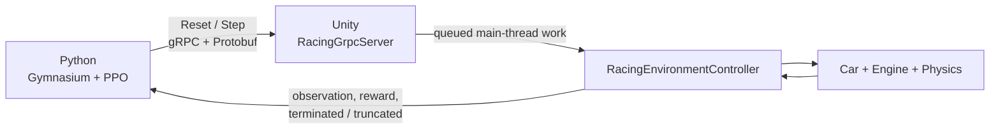

# Racing Game RL

An experimental Unity racing environment connected to Python reinforcement learning through a small gRPC and Protobuf bridge.

The project uses a driving controller from one of my previous Unity projects as the simulator. Python controls the car with Stable-Baselines3 PPO, while Unity is responsible for physics, checkpoints, rewards, and episode resets.

> **placeholder** a short clip of the trained car driving in `main_training`, with the road-probe gizmos visible

## Why this exists

The goal is to understand the core mechanics of a game-engine RL bridge:

- a Protobuf environment contract;
- a gRPC server running beside Unity physics;
- safe handoff from gRPC worker threads to Unity's main thread;
- a custom Gymnasium environment with no ML-Agents wrapper;
- PPO training, TensorBoard diagnostics, and deterministic evaluation.




## Current environment

- Unity 2022.3.51f training scene: `racing game (unity)/Assets/Scenes/main_training.unity`
- One car, one serialized Python client, and one physics tick per `Step` RPC
- 17 downward road-presence probes arranged in near, mid, and far rows
- Car velocity, slip angle, yaw rate, next-checkpoint direction, and checkpoint progress
- Continuous steering, throttle, and brake actions
- Checkpoint, lap, off-road, rollover, fall, stall, and time-limit episode handling
- Custom Gymnasium client and Stable-Baselines3 PPO training/evaluation scripts

> **placeholder** top-down Scene-view screenshot labeling the near, 5 m, and 10 m probe rows over the road mesh.

> **placeholder** charts showing checkpoint progress, road-probe activity, episode reward from a training run.

## Quick start

### 1. Open Unity

Open the Unity project under `racing game (unity)`, load `main_training`, and enter Play mode. The Unity console should report that the racing gRPC server is listening on `127.0.0.1:50051`.

### 2. Install Python dependencies

From the repository root:

```powershell
py -m pip install -r python/requirements.txt
```

### 3. Verify the bridge

```powershell
py .\python\health_check.py
py .\python\check_gym_env.py
```

### 4. Run a short training check

```powershell
py .\python\train_ppo.py --timesteps 4096 --run-name ppo_check
```

### 5. Evaluate a saved model

Keep Unity in Play mode:

```powershell
py .\python\evaluate_ppo.py --model .\runs\ppo_check\ppo_racing_final.zip
```

More protocol and Python details are in [proto/README.md](proto/README.md) and [python/README.md](python/README.md).

## Repository layout

```text
proto/                         Protobuf source and generated-binding notes
python/                        Gymnasium environment, PPO training, evaluation
racing game (unity)/
  Assets/Scripts/RL/           Unity environment controller and gRPC server
  Assets/Scenes/main_training  Lightweight RL training scene
tools/                         Unity C# Protobuf generation helper
```

## What happens during one step

1. PPO selects an action from the Gymnasium observation.
2. Python sends a unary `Step` request over gRPC.
3. The Unity server queues the action for the main thread.
4. Unity applies it, waits for one `FixedUpdate`, then samples physics and sensors.
5. Unity returns the next observation, reward, and episode state.

One Python action maps to one completed Unity physics transition.


## Training notes

The current model has learned early checkpoint progress on the training route. The next planned experiment is a more diverse curriculum with alternate spawn points to focus on learning sharp turns.

## License and credits

Vehicle model and other third-party Unity assets retain their own licenses. The repository is intended as an educational prototype built around my existing racing project.
